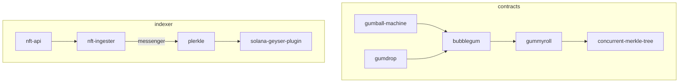

# Note!

This repository will be archived! The following programs have new homes in different repositories:

- `gummyroll` is now `account-compression` (owned and maintained by Solana Labs), and can be found in the [solana-program-library](https://github.com/solana-labs/solana-program-library/tree/master/account-compression)
- `candy-wrapper` is now `wrapper` (owned and maintained by Solana Labs), and can be found in the [solana-program-library](https://github.com/solana-labs/solana-program-library/tree/master/account-compression/programs/wrapper)
- `bubblegum` (owned and maintained by the Metaplex Foundation) can be found in the [metaplex-program-library](https://github.com/metaplex-foundation/metaplex-program-library/tree/master/bubblegum)
- `sugar-shack` and `gumball-machine` are proof-of-concept programs 

RPC-related infrastructure and anything related to indexing compressed NFTs can be found below:
- [metaplex-foundation/blockbuster](https://github.com/metaplex-foundation/blockbuster)
    - Program parsing for Geyser plugins
- [metaplex-foundation/digital-asset-rpc-infrastructure](https://github.com/metaplex-foundation/digital-asset-rpc-infrastructure)
    - Everything you need to run the infrastructure needed to index NFTs
- [metaplex-foundation/digital-asset-validator-plugin](https://github.com/metaplex-foundation/digital-asset-validator-plugin)
    - Geyser plugin, messenger, and serialization libraries related to compressed NFTs
# 🍬 Candyland 🍬

Smart contracts and indexing services necessary to migrate the Solana ecosystem to a 10,000x cheaper NFT standard.

# Smart Contracts

| Package | Description | Docs | Audit | Program Id |
| :-- | :-- | :--| :-- | :-- |
| `gummyroll` | On-chain merkle tree that supports concurrent writes | tbd | tbd | `GRoLLzvxpxxu2PGNJMMeZPyMxjAUH9pKqxGXV9DGiceU` |
| `bubblegum` | Token transfer and metadata functionality built on top of gummyroll | tbd | tbd | `BGUMAp9Gq7iTEuizy4pqaxsTyUCBK68MDfK752saRPUY` |
| `gumball-machine` | Candy machine built for bubblegum | tbd | tbd | `GBALLoMcmimUutWvtNdFFGH5oguS7ghUUV6toQPppuTW` |
| `sugar-shack` | Example Marketplace Implementation for Compressed NFTs | tbd | tbd | `9T5Xv2cJRydUBqvdK7rLGuNGqhkA8sU8Yq1rGN7hExNK` |

### Gummyroll - Merkle Tree 

Merkle tree root stores information of its leaves. 
We store a buffer of proof-like changelogs on-chain that allow multiple proof-based writes to succeed within the same slot.
This is accomplished by fast-forwarding out-of-date or possibly invalid proofs based upon the information in the changelogs.

Information about max tree height, maximum transaction size, and other constraints can be found in `tests/txLength.ts`.

##### Note on hashing:
It's industry standard to lexicographically sort inner nodes when hashing up the tree. However `gummyroll` does not implement this. Since indices are needed to find the intersection for the changelog array, we implement hashing using an index to order the nodes.

### Bubblegum - NFTs in Merkle Trees

Supports decompressing `bubblegum` NFTs into either `Tokenkeg` tokens or `Token22` tokens.
The benefit of decompressing a `bubblegum` NFT is that normal tokens can be moved into a custodial wallet and freely transferred
without relying on RPC nodes to serve your NFT data from an off-chain database.

### Gumball machine - Candy machine for NFT drops
For more information on candy machine: `https://docs.metaplex.com/candy-machine-v2/introduction`

### Sugar Shack - Example Marketplace Implementation for Compressed NFTs
Sugar Shack is a mock implementation for how a Marketplace could faciliatate listings of compressed NFTs for purchase. Docs TBD.

## Running Tests

`cd contracts; anchor test` will run tests.

If tests are failing by timing out, then this likely means that certain programs are not loaded in the local validator.
This is remedied by adding the program & address to a `[[test.genesis]]` entry in `Anchor.toml`.
You can tell if this is the issue by turning `skipPreflight` to `false`. Simulation error will show programId not found.

