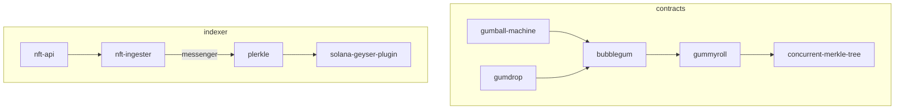

# 🍬 Candyland 🍬

Smart contracts and indexing services necessary to migrate the Solana ecosystem to a 10,000x cheaper NFT standard.



# Smart Contracts

| Package | Description | Docs | Audit | Program Id |
| :-- | :-- | :--| :-- | :-- |
| `gummyroll` | On-chain merkle tree that supports concurrent writes | tbd | tbd | `GRoLLzvxpxxu2PGNJMMeZPyMxjAUH9pKqxGXV9DGiceU` |
| `bubblegum` | Token transfer and metadata functionality built on top of gummyroll | tbd | tbd | `BGUMAp9Gq7iTEuizy4pqaxsTyUCBK68MDfK752saRPUY` |
| `gumball-machine` | Candy machine built for bubblegum | tbd | tbd | `GBALLoMcmimUutWvtNdFFGH5oguS7ghUUV6toQPppuTW` |
| `sugar-shack` | Example Marketplace Implementation for Compressed NFTs | tbd | tbd | `9T5Xv2cJRydUBqvdK7rLGuNGqhkA8sU8Yq1rGN7hExNK` |

### Gummyroll - Merkle Tree 

Merkle tree root stores information of its leaves. 
We store a buffer of proof-like changelogs on-chain that allow multiple proof-based writes to succeed within the same slot.
This is accomplished by fast-forwarding out-of-date or possibly invalid proofs based upon the information in the changelogs.


Information about max tree height, maximum transaction size, and other constraints can be found in `tests/txLength.ts`.

##### Note on hashing:
It's industry standard to lexicographically sort inner nodes when hashing up the tree. However `gummyroll` does not implement this. Since indices are needed to find the intersection for the changelog array, we implement hashing using an index to order the nodes.

### Bubblegum - NFTs in Merkle Trees

Supports decompressing `bubblegum` NFTs into either `Tokenkeg` tokens or `Token22` tokens.
The benefit of decompressing a `bubblegum` NFT is that normal tokens can be moved into a custodial wallet and freely transferred
without relying on RPC nodes to serve your NFT data from an off-chain database.

### Gumball machine - Candy machine for NFT drops
For more information on candy machine: `https://docs.metaplex.com/candy-machine-v2/introduction`

### Sugar Shack - Example Marketplace Implementation for Compressed NFTs
Sugar Shack is a mock implementation for how a Marketplace could faciliatate listings of compressed NFTs for purchase. Docs TBD.

<<<<<<< HEAD
=======
### Gumdrop - Airdrop compressed NFTs
Copied from here: `https://github.com/metaplex-foundation/metaplex-program-library/tree/master/gumdrop`

Additions to the MPL gumdrop: 
- `new_distributor_compressed` ix (needed to setup `claim_bubblegum`)
- `claim_bubblegum` ix (needed to claim NFTs into compressed tree)

# Indexer

This is the bread and butter of this project. Gummyroll relies on RPC indexers to store merkle tree leaf data off-chain. 

| Portions | Description | Docs |
| :------- | :------- | :--- |
| `nft_ingester` | Service to ingest compressed NFT events from logs and insert into postgres database | tbd |
| `nft_api` | REST api to serve proofs and other information from postgres database. Eventually will become JSON RPC api. | tbd |
| `plerkle` | Generalized geyser plugin to store regular and compressed NFT information | tbd |
| `plerkle_serialization` | Flatbuffer schemas for optimally transporting geyser plugin information | tbd |
| `messenger` | Traits needed to generalize messaging bus for NFT related indexing | tbd |

## Getting Started
```
cd candyland/
git submodule update --init --recursive
chmod +x link-local-sdks.sh
./link-local-sdks.sh
cd contracts/
anchor build
cd ..
docker compose up --build --force-recreate
```

Note: link-local-sdks.sh will install all dependencies needed to work in `cli/` and `contracts`, and link all of the public NPM SDKs for your local changes to propagate immediately. If at any time you would rather just work with the releases available at the registry you can run `chmod +x unlink-local-sdks.sh && ./unlink-local-sdks.sh` which will unlink all of the public SDKs and re-install all dependencies for `contracts` and `cli` from the NPM registry.

#### In another terminal:
```
cd candyland/contracts/
yarn
yarn run ts-mocha -t 1000000 tests/bubblegum-test-rpc.ts  //<--- this test actually hits the RPC node for proofs
yarn run ts-mocha -t 1000000 tests/continuous_gummyroll-test.ts
```

>>>>>>> main
## Running Tests

`cd contracts; anchor test` will run tests.

If tests are failing by timing out, then this likely means that certain programs are not loaded in the local validator.
This is remedied by adding the program & address to a `[[test.genesis]]` entry in `Anchor.toml`.
You can tell if this is the issue by turning `skipPreflight` to `false`. Simulation error will show programId not found.

